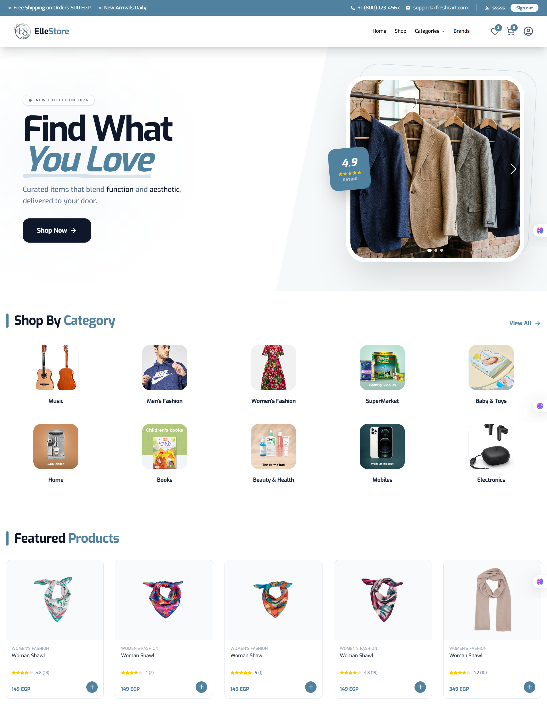
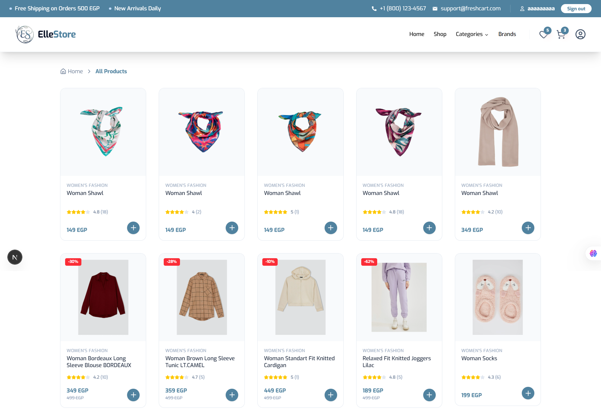
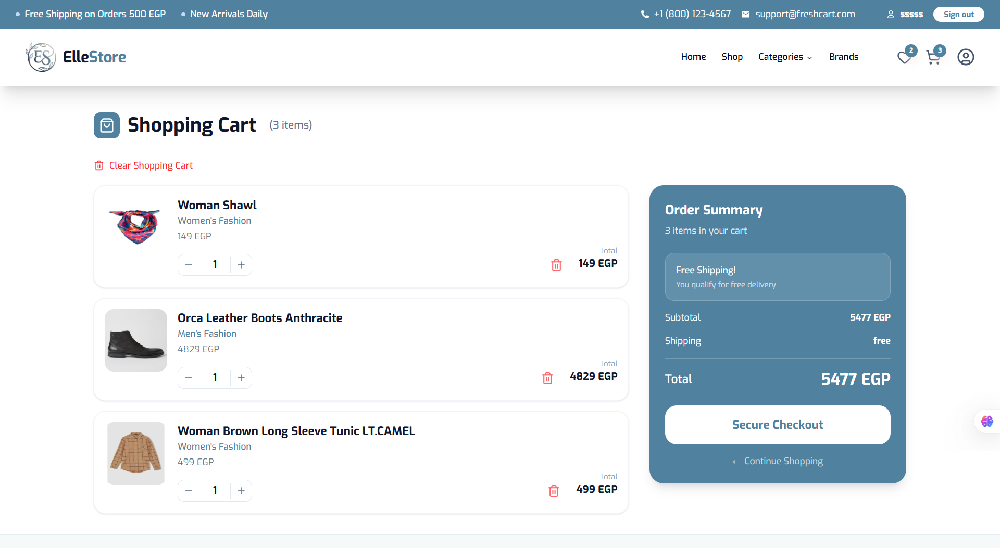
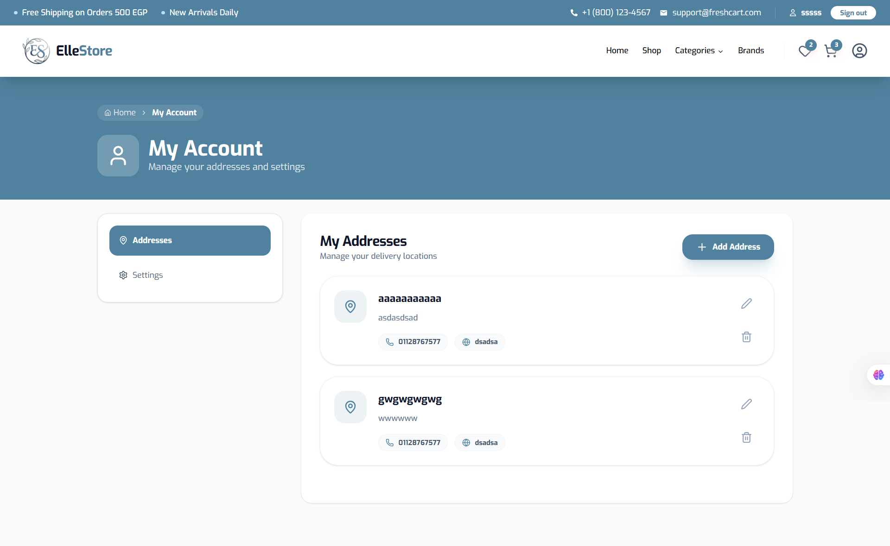

## 🛍️ ElleStore

A modern, full-featured eCommerce web application built with Next.js, React, TypeScript, and Tailwind CSS.
ElleStore provides a fast, scalable, and user-friendly shopping experience with authentication, cart management, wishlist functionality, and order processing.


## 🌐 Live Demo

👉 https://elle-store.vercel.app


## 📸 Screenshots







## ✨ Key Features

- ⚡ Responsive product catalog with featured carousel
- 🏷️ Category and brand browsing
- 🛒 Full shopping cart & wishlist functionality
- 🔐 Secure authentication powered by NextAuth
- 👤 User profile with address & order history
- 💳 Checkout and order submission flow
- 🔔 Global toast notifications for feedback
- 📦 Server-side data fetching with reusable services
- 🚀 Optimized performance with lazy loading and SSR

## 🧰 Tech Stack

- Framework: Next.js 16 (App Router)
- Frontend: React 19, TypeScript, Tailwind CSS 4
- Authentication: NextAuth
- Forms: React Hook Form + Zod
- UI: Radix UI + shadcn/ui
- Carousel: Swiper
- Notifications: React Hot Toast
- State Management: Context API
- API: REST APIs with JWT authentication

## 🧱 Project Structure

- `src/app/` - Pages & layouts (App Router)
- `src/app/_components/` - Reusable UI & feature components
- `src/app/_context/` - Global state (cart, wishlist)
- `src/services/` - API service layer
- `src/interfaces/` - TypeScript types & interfaces
- `src/assets/imgs/` - Project image assets
- `src/components/ui/` - Shared UI components

## 🚀 Getting Started

### 📦 Prerequisites

- Node.js 20+ recommended
- npm, pnpm, or yarn

### 📥 Install Dependencies

```bash
npm install
```

### ▶️ Run Locally

```bash
npm run dev
```

Open `http://localhost:3000` in your browser to view the app.

### 🏗️ Build for Production

```bash
npm run build
npm run start
```

### 🧹 Linting

```bash
npm run lint
```

## 🔐 Authentication

This project uses NextAuth for user sign-in and registration. The app includes pages for:

- `/login`
- `/register`
- `/forgetPassword`
- `/resetPassword`
- `/verifyCode`
- `/profile`

Session state is managed globally through the `WrapperSessionProvider` and cart/wishlist state is hydrated at app layout load.

## 📡 Data Source

The application fetches data from an external API using a structured service layer, ensuring clean separation of concerns and scalability.

## 🚧 Notes & Optimizations

- Cart and wishlist are initialized in `src/app/layout.tsx`
- State is shared globally via context providers
- Homepage uses:
  - Dynamic featured product grid
  - Lazy-loaded categories
- Designed for scalability and performance

## 👩‍💻 Author
Mariam Tarek
GitHub: https://github.com/MariamTarek098


## ⭐ Support

If you like this project, give it a ⭐ on GitHub!